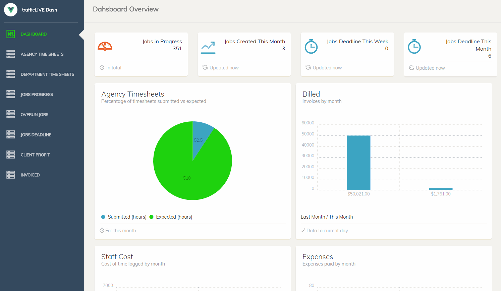

# trafficLIVE Vuejs Charts

Export [trafficLIVE](https://www.deltek.com/en/products/project-and-portfolio-management/trafficlive) data from the REST API to an SQL server. Built in SQL queries to create highly relational data, rendered in a responsive Vuejs dashboard based on [vue-chartjs](http://vue-chartjs.org).

# Installation

Dependencies: 
[Nodejs](https://nodejs.org/en//) &
MySQL or MariaDB

1. `git clone https://github.com/owainharris/TL-Dash-SQL`
2. `cd TL-Dash-SQL`
3. `$ npm i`

### Running the application

`$ npm start`

Demo [here](https://174.138.60.125/#/admin/overview)